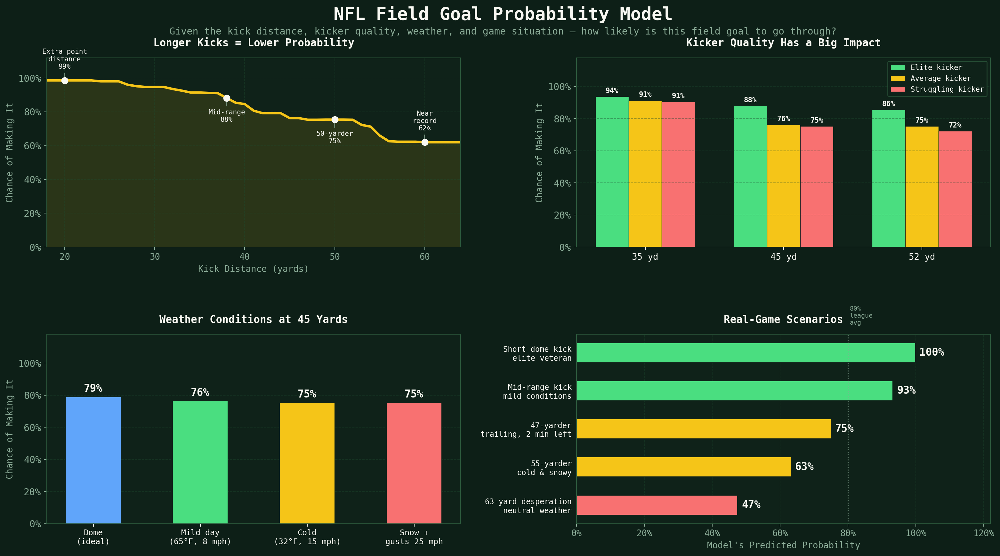
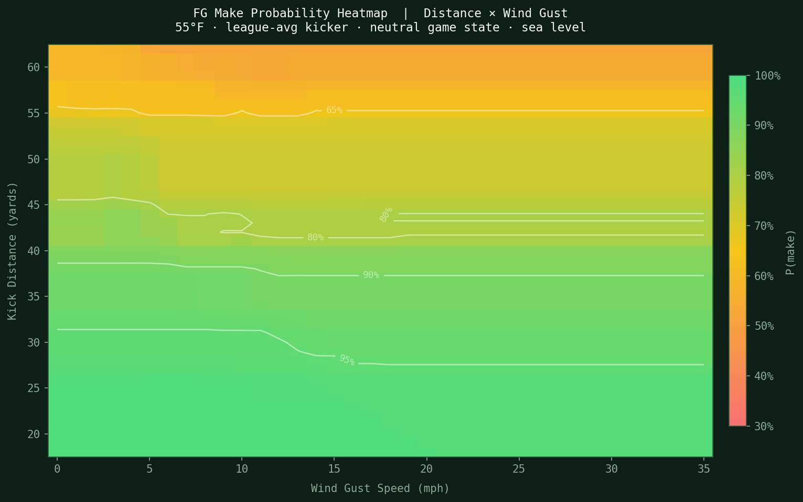

# NFL Overtime 4th-Down Model

Bruin Sports Analytics (UCLA) football project behind **[playbyplay.football](https://playbyplay.football)**,
a decision engine for 4th down in NFL overtime: **go for it, punt, or kick?** For a given situation it
estimates win probability for each choice and recommends one.

Overtime rules changed in 2022 (playoffs) and 2024 (regular season): both teams now get a possession, so
the right call depends on which possession you're in and what the other team just did. Static 4th-down
charts don't capture that.

This repo holds the data pipeline and models. The web app lives in a separate repo.



## Field-goal make-probability model

`src/models/fg_probability.py` estimates **P(field goal is good)**.

**Data:** every unblocked NFL field-goal attempt, 2016–2024 (nflfastR play-by-play via `nfl_data_py`),
joined with stadium, weather, and kicker history. Blocked kicks are excluded, because a block is a
defensive event rather than a kicker miss.

**15 features:**

| Group | Features |
|---|---|
| Kick | distance, dome, grass vs. turf, stadium altitude |
| Weather | wind gust, gust × distance, temperature, temperature × distance, precipitation |
| Kicker | rolling 6-game make rate and career make rate at that distance bucket, career attempts in the bucket |
| Game state | seconds remaining, score differential, overtime |

**Model:** XGBoost classifier tuned with `RandomizedSearchCV` (60 iterations, 5-fold) on Brier score,
then **isotonic calibration** (5-fold), because the decision engine multiplies this probability against
others, so 70% has to mean 70%. The train/test split is stratified by season so every era is in both sets.
On the held-out 20% (1,749 of 8,742 kicks): **ROC-AUC 0.78**, **Brier score 0.104** (vs. 0.122 for
always predicting the 85.8% league make rate), log loss 0.337.



More figures in `outputs/`: feature importance, sensitivity sweeps, scenario comparisons, and make rate
by distance, wind, temperature, and season. `fg_probability_visual.html` is an interactive version.

## Repo layout

```
src/data/download_pbp.py         download 2016–2024 play-by-play
src/data/make_special_teams.py   FG / punt / kickoff tables, rolling and leakage-safe career kicker stats
src/data/make_splits.py          train / test splits
src/models/fg_probability.py     FG make-probability model (train + predict_fg_prob)
fg_*_plots.py                    figure scripts → outputs/
```

## Run

```bash
pip install -r requirements.txt
python -m src.data.download_pbp
python -m src.data.make_special_teams
python -m src.models.fg_probability        # trains, prints metrics, saves models/fg_prob_model.pkl
```

```python
from src.models.fg_probability import predict_fg_prob
predict_fg_prob(kick_distance=47, is_dome=False, wind=12, temp=42, fg_make_rate_roll6=0.81)
```

## Team

Built by the Bruin Sports Analytics football team (8 members). In this repo: Eshaan Dhavala (data
pipeline, field-goal model and figures), Maia Salti (special-teams feature extraction, web app),
Abhi Kumar (interactive FG visualization).
